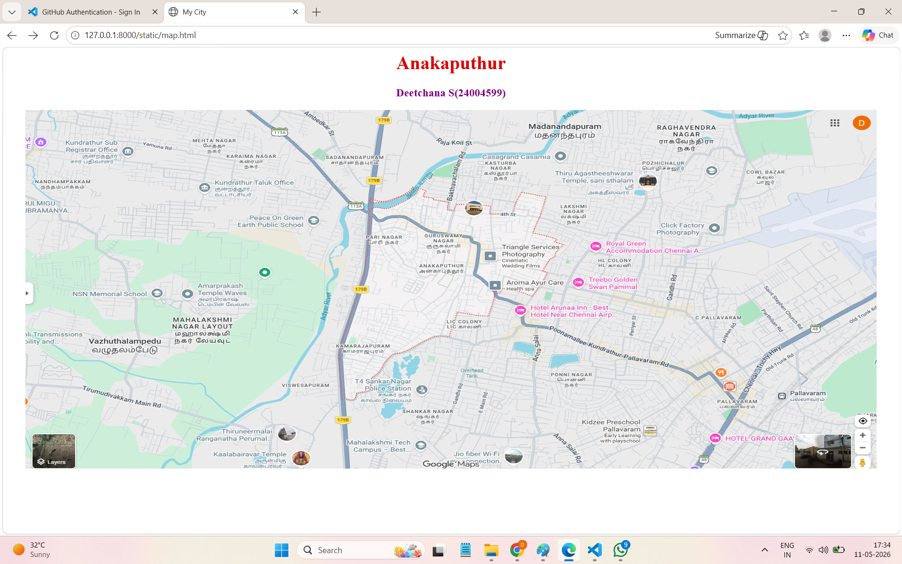
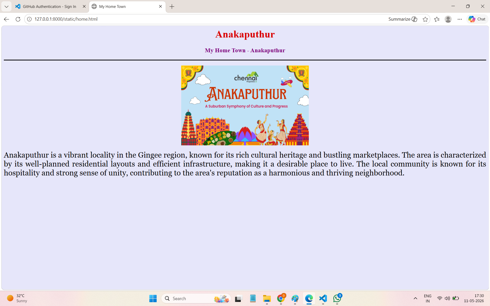
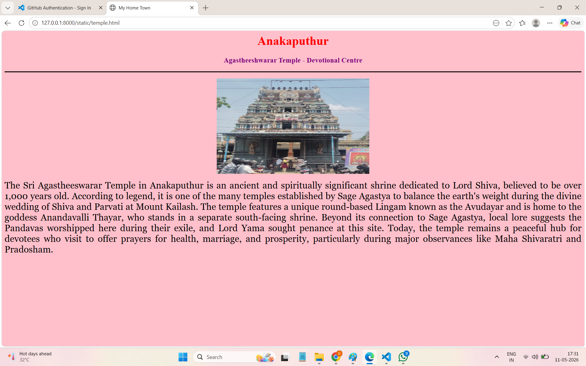
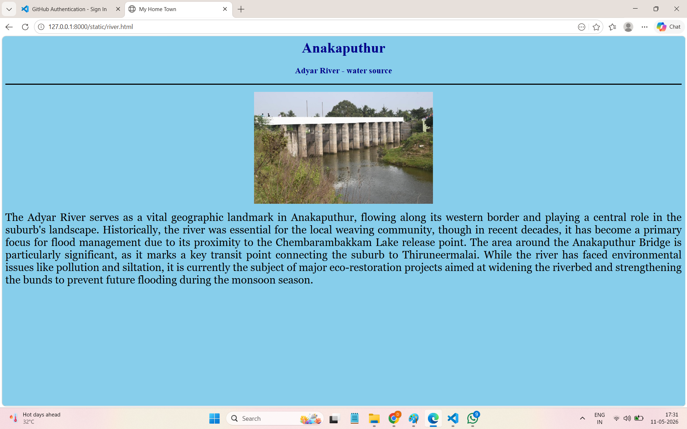
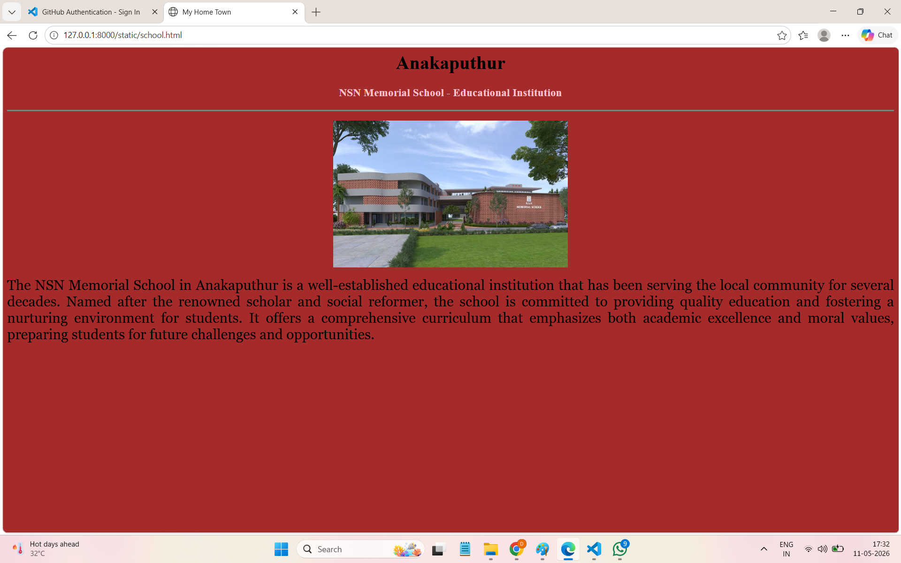
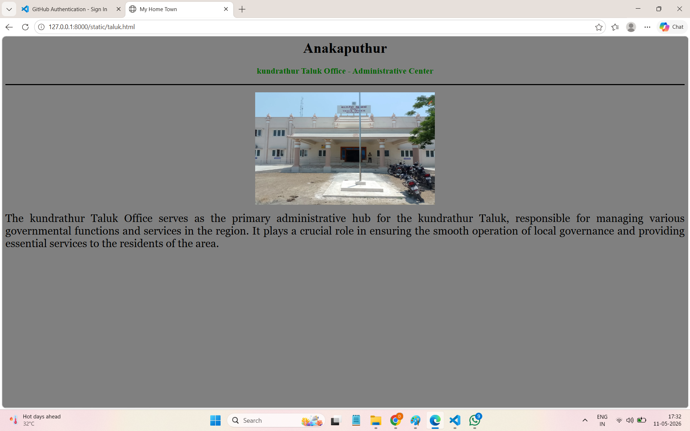

# Ex03 Places Around Me
# Date: 11.05.2026
# AIM
To develop a website to display details about the places around my house.

# DESIGN STEPS
## STEP 1
Create a Django admin interface.

## STEP 2
Download your city map from Google.

## STEP 3
Using <map> tag name the map.

## STEP 4
Create clickable regions in the image using <area> tag.

## STEP 5
Write HTML programs for all the regions identified.

## STEP 6
Execute the programs and publish them.

# CODE
```
map.html

<html>
<head>
<title>My City</title>
</head>
<body>
<h1 align="center">
<font color="darkpink"><b>Anakaputhur</b></font>
</h1>
<h3 align="center">
<font color="purple"><b>Deetchana S(24004599)</b></font>
</h3>
<center>

<map name="MyCity">
<area shape="rect" coords="1040,481,829,417" href="home.html" title="My Home Town">
<area shape="rect" coords="1382,228,1171,164" href="temple.html" title="Agastheeshwarar Temple">
<area shape="rect" coords="633,603,695,489" href="river.html" title="Adyar River">
<area shape="rect" coords="310,541,99,477" href="school.html" title="NSN Memorial School">
<area shape="rect" coords="348,166,638,260" href="taluk.html" title="Kundarathur Taluk Office">
</map>
</center>
</body>
</html>

```

```
home.html


<html>
<head>
<title>My Home Town</title>
</head>
<body bgcolor="lavender">
<h1 align="center">
<font color="darkpink"><b>Anakaputhur</b></font>
</h1>
<h3 align="center">
<font color="purple"><b>My Home Town - Anakaputhur</b></font>
</h3>
<hr size="3" color="black">
<p align="center">

</p>
<p align="justify">
<font face="Georgia" size="5">
Anakaputhur is a vibrant locality in the Gingee region, known for its rich cultural heritage and bustling marketplaces. The area is characterized by its well-planned residential layouts and efficient infrastructure, making it a desirable place to live. The local community is known for its hospitality and strong sense of unity, contributing to the area's reputation as a harmonious and thriving neighborhood.
</p>
</body>
</html>

```

```
temple.html


<html>
<head>
<title>My Home Town</title>
</head>
<body bgcolor="pink">
<h1 align="center">
<font color="red"><b>Anakaputhur</b></font>
</h1>
<h3 align="center">
<font color="purple"><b>Agastheeshwarar Temple - Devotional Centre</b></font>
</h3>
<hr size="3" color="black">
<p align="center">

</p>
<p align="justify">
<font face="Georgia" size="5">
The Sri Agastheeswarar Temple in Anakaputhur is an ancient and spiritually significant shrine dedicated to Lord Shiva, believed to be over 1,000 years old. According to legend, it is one of the many temples established by Sage Agastya to balance the earth's weight during the divine wedding of Shiva and Parvati at Mount Kailash. The temple features a unique round-based Lingam known as the Avudayar and is home to the goddess Anandavalli Thayar, who stands in a separate south-facing shrine. Beyond its connection to Sage Agastya, local lore suggests the Pandavas worshipped here during their exile, and Lord Yama sought penance at this site. Today, the temple remains a peaceful hub for devotees who visit to offer prayers for health, marriage, and prosperity, particularly during major observances like Maha Shivaratri and Pradosham.
</p>
</body>
</html>

```

```
river.html


<html>
<head>
<title>My Home Town</title>
</head>
<body bgcolor="skyblue">
<h1 align="center">
<font color="darkblue"><b>Anakaputhur</b></font>
</h1>
<h3 align="center">
<font color="darkblue"><b>Adyar River - water source</b></font>
</h3>
<hr size="3" color="black">
<p align="center">

</p>
<p align="justify">
<font face="Georgia" size="5">
The Adyar River serves as a vital geographic landmark in Anakaputhur, flowing along its western border and playing a central role in the suburb's landscape. Historically, the river was essential for the local weaving community, though in recent decades, it has become a primary focus for flood management due to its proximity to the Chembarambakkam Lake release point. The area around the Anakaputhur Bridge is particularly significant, as it marks a key transit point connecting the suburb to Thiruneermalai. While the river has faced environmental issues like pollution and siltation, it is currently the subject of major eco-restoration projects aimed at widening the riverbed and strengthening the bunds to prevent future flooding during the monsoon season.
</p>
</body>
</html>

```

```
school.html


<html>
<head>
<title>My Home Town</title>
</head>
<body bgcolor="brown">
<h1 align="center">
<font color="black"><b>Anakaputhur</b></font>
</h1>
<h3 align="center">
<font color="pink"><b>NSN Memorial School - Educational Institution</b></font>
</h3>
<hr size="3" color="grey">
<p align="center">

</p>
<p align="justify">
<font face="Georgia" size="5">
The NSN Memorial School in Anakaputhur is a well-established educational institution that has been serving the local community for several decades. Named after the renowned scholar and social reformer, the school is committed to providing quality education and fostering a nurturing environment for students. It offers a comprehensive curriculum that emphasizes both academic excellence and moral values, preparing students for future challenges and opportunities.
</p>
</body>
</html>

```

```
taluk.html


<html>
<head>
<title>My Home Town</title>
</head>
<body bgcolor="grey">
<h1 align="center">
<font color="black"><b>Anakaputhur</b></font>
</h1>
<h3 align="center">
<font color="darkgreen"><b>kundrathur Taluk Office - Administrative Center</b></font>
</h3>
<hr size="3" color="black">
<p align="center">

</p>
<p align="justify">
<font face="Georgia" size="5">
The kundrathur Taluk Office serves as the primary administrative hub for the kundrathur Taluk, responsible for managing various governmental functions and services in the region. It plays a crucial role in ensuring the smooth operation of local governance and providing essential services to the residents of the area.
</p>
</body>
</html>

```
# OUTPUT







# RESULT
The program for implementing image maps using HTML is executed successfully.
